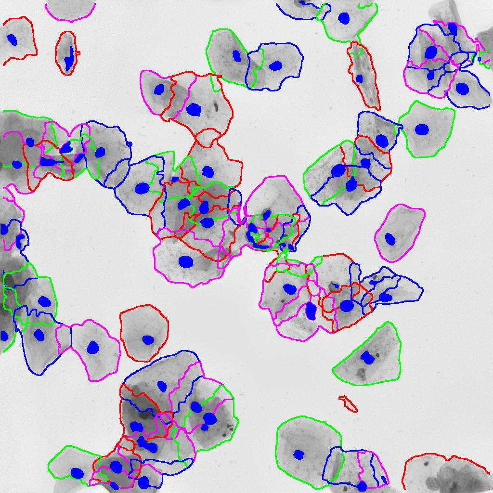

# math4bioimaging
=================
Applied Math for Bioimaging

- use-cases explored in partnerships between Berkeley Lab, UC Berkeley, private sponsors and foreign institutions
- bioimaging and algorithms:
  - cell
  - tissue
  - blood
  - brain
  - eye
  - heart
  - cervix
